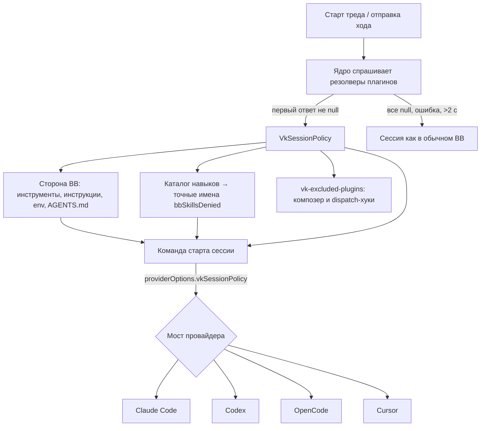

# Экспериментальные функции ядра BB (VK)

> [!NOTE]
> Этих функций нет в обычном BB. Они есть только в сборке из форка [VKirill/bb](https://github.com/VKirill/bb), ветка `vk/experimental`. Эта сборка сейчас работает на хабе. В коде все места помечены `VK EXPERIMENTAL`, у имён префикс `vk`. Список точек, где форк правит файлы upstream, лежит в [VK_PATCHES.md](VK_PATCHES.md).

Функции позволяют плагину решать, что загружается в конкретную сессию агента: плагины BB, навыки, MCP-серверы, плагины самих CLI и инструкции. Идея как у Multica: в BB может быть 100 навыков, а агенту конкретной роли достаются только его три.

Эталонный потребитель — плагин [project-folders](https://github.com/VKirill/bb-plugin-project-folders), вкладка «Контекст сессии». В нём правила задаются для всего BB, для проекта и для раздела и наследуются вниз по дереву.

## Состав

| # | Функция | Где | Для чего |
| --- | --- | --- | --- |
| 1 | `bb.agents.experimental_vkSessionPolicy(resolver)` | API плагина (сервер) | Плагин отвечает на вопрос «что грузить в эту сессию» |
| 2 | `VkSessionPolicy` | `@bb/domain/vk-session-policy` | Формат правил |
| 3 | `bb.agents.experimental_vkContextContributions()` | API плагина (сервер) | Что каждый плагин добавляет в сессии |
| 4 | Применение правил в ядре | `thread-runtime-config.ts`, `thread-commands.ts` | Отсекает инструменты, инструкции, env и навыки BB |
| 5 | `vkSessionPolicy` в опциях провайдера | мосты Claude Code, Codex, OpenCode, Cursor | Отсекает родные навыки, MCP и плагины CLI |
| 6 | Полное исключение плагина из места | `GET /api/v1/plugins/vk-excluded-plugins`, композер, dispatch-хуки | Исключённый плагин исчезает и из интерфейса, и из хуков |
| 7 | `vkPlace` у композера | `plugin-composer-host.tsx`, `NewThreadComposer.tsx` | Композер знает место нового треда до его создания |



---

## 1. `bb.agents.experimental_vkSessionPolicy(resolver)`

Регистрирует резолвер: функцию, которая для конкретного треда возвращает правила или `null`.

```ts
experimental_vkSessionPolicy?(
  resolver: (
    context: PluginAgentConfigurationContext,
  ) => VkSessionPolicy | null | Promise<VkSessionPolicy | null>,
): void;
```

**Когда вызывается.** В тех же точках и с тем же контекстом, что `bb.agents.configure`: при старте треда (`thread.start`) и при отправке хода (`turn.submit`).

**Контекст (`PluginAgentConfigurationContext`)** — стандартный, как у `configure`:

| Поле | Что внутри |
| --- | --- |
| `thread` | `id`, `title`, `parentThreadId`, `sourceThreadId` |
| `project` | `id`, `kind`, `name`, `gitRemoteUrl` |
| `environment` | `id`, `name`, `path` (папка сессии), `branchName` |
| `host` | `id`, `name` |
| `provider` | `id` (`claude-code`, `codex`, `opencode`, `cursor`…), `model`, `capabilities` |
| `origin` | `kind`, `pluginId` — для тредов, созданных плагином через `bb.sdk.threads.spawn`, здесь его id |
| `pluginMetadata` | метаданные треда под id вашего плагина, как в `configure` (недоверенные данные) |

**Правила работы:**

- Возвращайте `null`, если плагину нечего сказать про этот тред. Тогда сессия собирается как в обычном BB.
- Если резолверы есть у нескольких плагинов, побеждает **первый ответ не `null`** в порядке id плагинов. Правила **не объединяются** (подробнее в разделе про Агентство).
- Исключение, ответ неверной формы или ответ дольше 2 секунд попадают в лог и считаются `null`: сессия открывается без ограничений (fail open).
- Один резолвер на один запуск фабрики плагина.
- Плагин, чей ответ победил, никогда не исключается сам, даже если его id не попал в `bbPlugins`. Иначе правила могли бы отключить сами себя.

**Проверка наличия.** В обычном BB метода нет, поэтому сначала проверяйте его наличие. Типов в опубликованном `@get-bb/plugin-sdk` тоже нет, поэтому объявите их локально, как в project-folders:

```ts
type VkFilter = { mode: "allow" | "deny"; names: string[] };
type VkSessionPolicy = {
  bbPlugins?: VkFilter;
  skills?: VkFilter;
  mcpServers?: VkFilter;
  nativePlugins?: VkFilter;
  userInstructions?: boolean;
  projectInstructions?: boolean;
  claudeAiSync?: boolean;
};
type VkAgents = {
  experimental_vkSessionPolicy?: (
    resolver: (ctx: any) => VkSessionPolicy | null | Promise<VkSessionPolicy | null>,
  ) => void;
  experimental_vkContextContributions?: () => Array<{
    pluginId: string;
    instructions: boolean;
    configure: boolean;
    tools: string[];
    skills: string[];
  }>;
};

const agents = bb.agents as unknown as VkAgents;
export const vkAvailable = typeof agents.experimental_vkSessionPolicy === "function";

if (vkAvailable) {
  agents.experimental_vkSessionPolicy!((ctx) => {
    if (ctx.origin.pluginId !== "agency") return null; // not our thread
    const role = ctx.pluginMetadata.role; // written by Agency at spawn
    return policyForRole(role);
  });
}
```

Интерфейс настройки показывайте только при `vkAvailable === true`. Так сделано в project-folders: на обычном BB вкладки «Контекст сессии» просто нет.

---

## 2. Формат правил `VkSessionPolicy`

Все поля необязательные. Отсутствующее поле значит «грузить как обычно», поэтому пустой объект `{}` ничего не меняет.

| Поле | Тип | Что ограничивает | Какие имена |
| --- | --- | --- | --- |
| `bbPlugins` | фильтр | Плагины BB: их инструкции, инструменты агента, навыки, env, а также UI и хуки в этом месте | id плагина: `agency`, `env-catalog`, `lane-pilot` |
| `skills` | фильтр | Навыки по имени: и из BB, и родные навыки CLI | как их вызывает агент: `ru-text`, `lane-stack:ru-text` |
| `mcpServers` | фильтр | Родные MCP-серверы CLI | имя сервера из `~/.claude.json`, `.mcp.json`, `~/.codex/config.toml` и т. п.; для MCP плагинов Claude — `plugin:<plugin>:<server>` или короткое имя |
| `nativePlugins` | фильтр | Плагины самих CLI | Claude: `name@marketplace`; Codex: id плагина |
| `userInstructions` | `boolean` | Общие инструкции BB `<dataDir>/AGENTS.md` | `false` — не грузить |
| `projectInstructions` | `boolean` | `.bb/AGENTS.md` раздела и `CLAUDE.md` / `AGENTS.md`, которые CLI находит в папке и её родителях | `false` — не грузить |
| `claudeAiSync` | `boolean` | Синхронизацию навыков и плагинов из claude.ai в Claude Code | `false` — выключить |

**Фильтр** — `{ mode: "allow" | "deny", names: string[] }`:

- `allow` — оставить только перечисленное, всё прочее убрать;
- `deny` — убрать перечисленное, остальное оставить;
- имена сравниваются точно, `*` в конце означает префикс: `lane-stack:*`;
- у одного предмета может быть несколько написаний (`ru-text` и `lane-stack:ru-text`). `allow` пропускает его, если указано любое из них, `deny` убирает, если указано любое;
- лимиты: до 500 имён в списке, имя до 200 символов.

Пример — «агент-копирайтер»: из плагинов BB только env-catalog, два навыка, без MCP, без инструкций проекта:

```json
{
  "bbPlugins": { "mode": "allow", "names": ["env-catalog"] },
  "skills": { "mode": "allow", "names": ["ru-text", "lane-stack:copy-*"] },
  "mcpServers": { "mode": "allow", "names": [] },
  "projectInstructions": false
}
```

> [!IMPORTANT]
> `bb-bridge` — служебный MCP самого BB: через него идут инструменты плагинов. Он остаётся всегда, фильтр `mcpServers` его не трогает.

---

## 3. `bb.agents.experimental_vkContextContributions()`

Возвращает список всех запущенных плагинов с тем, что каждый добавляет в сессии агентов:

```ts
interface VkContextContribution {
  pluginId: string;
  instructions: boolean; // adds instructions (contributeInstructions / dynamic)
  configure: boolean;    // chooses its tools and skills per thread via configure
  tools: string[];       // agent tool names
  skills: string[];      // skill names
}
```

Для чего нужен: в редакторе правил можно подписать каждый плагин («добавляет инструкции, 5 инструментов, 3 навыка») и отличить плагины, которые меняют контекст, от плагинов, которые дают только интерфейс. В project-folders из этого сделаны подписи у переключателей.

---

## 4. Что ядро делает само (сторона BB)

Когда правила получены, ядро до старта сессии:

1. **Убирает инструменты агента** плагинов, которые не прошли `bbPlugins`. Встроенные инструменты ядра (например, `update_environment_directory`) остаются.
2. **Убирает инструкции** этих плагинов: и статические, и динамические, и инструкции к их инструментам.
3. **Убирает переменные окружения** этих плагинов (`contributeProviderEnv`). Проверено на cli-agents: исключённый плагин не может навязать агента через env.
4. При `userInstructions: false` убирает `<dataDir>/AGENTS.md`, при `projectInstructions: false` — `.bb/AGENTS.md` рабочей папки.
5. **Навыки BB** (из плагинов, `<dataDir>/skills`, `.bb/skills` проекта) проверяет по каталогу и превращает в точный список запрещённых имён `bbSkillsDenied`. Навык отсекается, если не прошёл его плагин или его имя не прошло `skills`.

Общий каталог навыков окружения не меняется. Каждый мост собирает для своей сессии отфильтрованную копию из симлинков (`vkFilterSkillRoot`). Поэтому два треда с разными правилами в одном окружении не мешают друг другу.

---

## 5. Правила в мостах провайдеров

Остальное ядро передаёт мосту в опции провайдера `vkSessionPolicy`. Её формат — `VkRuntimeSessionPolicy`: `bbSkillsDenied`, `skills`, `mcpServers`, `nativePlugins` и флаги `projectInstructions: false`, `claudeAiSync: false`. Отдельный `HOME`, `CLAUDE_CONFIG_DIR` или `CODEX_HOME` не создаётся, поэтому вход в аккаунт и возобновление сессий работают как раньше.

| Провайдер | Навыки BB | Родные навыки | MCP-серверы | Плагины CLI | Инструкции проекта |
| --- | --- | --- | --- | --- | --- |
| **Claude Code** | отфильтрованная папка плагина навыков | SDK `skills` (allow), `skillOverrides` + `disallowedTools: Skill(...)` | `strictMcpConfig` + конфиги из `~/.claude.json`, `.mcp.json` и `.mcp.json` включённых плагинов; `deniedMcpServers` | `enabledPlugins: false` | `claudeMdExcludes` (папка, родители, подпапки; `~/.claude` пользователя остаётся) |
| **Codex** | отфильтрованные доп. корни | `-c skills.config=[{path\|name, enabled=false}]`, рекурсивно, имя из frontmatter | `-c mcp_servers.<n>.enabled=false` (только серверы из `config.toml`) | `-c plugins.<id>.enabled=false` | `-c project_doc_max_bytes=0` |
| **OpenCode** | фильтр списка навыков в инструкциях | `OPENCODE_CONFIG_CONTENT` → `permission.skill` | `OPENCODE_CONFIG_CONTENT` → `mcp.<n>.enabled=false` | — | `OPENCODE_DISABLE_PROJECT_CONFIG=1` |
| **Cursor (Grok)** | фильтр списка навыков в инструкциях | — | отдельный `CURSOR_DATA_DIR` на набор правил (`~/.cursor/bb-vk-overlays/<hash>`) со своим `mcp-disabled.json`; настоящая папка проекта подключена ссылкой | — | — |

`claudeAiSync: false` ставит в Claude Code `syncClaudeAiSkills` и `syncClaudeAiPlugins` в `false`.

---

## 6. Полное исключение плагина из места

Если правила места убирают плагин (`bbPlugins`), BB ведёт себя там так, будто плагина нет:

- **Сессия:** нет инструментов, инструкций, навыков и env (раздел 4).
- **Композер:** не рисуются кнопки, баннеры, чипы и прочие вставки плагина в поле ввода. Фильтр стоит в `useResolvedComposerSlot`.
- **Отправка сообщения:** `message.dispatch` пропускает хуки плагина и отбрасывает его данные из композера.

Список исключённых для места отдаёт маршрут:

```http
GET /api/v1/plugins/vk-excluded-plugins?threadId=thr_…
GET /api/v1/plugins/vk-excluded-plugins?projectId=…&hostId=…&environmentId=…&path=…
→ { "pluginIds": ["agency"] }
```

Для существующего треда достаточно `threadId`. Для нового треда, которого ещё нет, композер передаёт проект, машину, окружение и папку раздела. В обычном BB маршрута нет; клиент тогда считает, что ничего не исключено. На клиенте ответ кешируется на 15 секунд.

> [!TIP]
> Для Агентства это значит: если в разделе Агентство выключено, его переключатель «Сам сделает / Агентство / По запросу» в этом разделе не появится, а его dispatch-хук не сработает. Отдельно в Агентстве это делать не нужно.

---

## 7. `vkPlace` у композера

Необязательное поле `vkPlace` у хоста композера (`plugin-composer-host.tsx`) — место, для которого композер спрашивает список исключённых плагинов. В новом треде его заполняет `NewThreadComposer`. Папку раздела он берёт из `environmentSeed.providerInputs`, потому что поле отправки её теряет. Плагину здесь ничего делать не нужно: это внутренняя часть функции 6.

---

## Как внедрить в Агентство

> [!WARNING]
> **Главное ограничение: правила не объединяются.** Побеждает первый ответ не `null` по алфавиту id плагинов. `agency` идёт раньше `project-folders`. Если Агентство вернёт правила для треда, правила раздела из project-folders для этого треда **полностью перестанут действовать**.

Рекомендуемая схема — как у Multica: правила по роли агента.

1. **Отвечать только за свои треды.** Для остальных возвращать `null`. Треды, созданные через `bb.sdk.threads.spawn`, ядро помечает id плагина: `ctx.origin.pluginId === "agency"`. Роль сотрудника удобно записать в метаданные треда при создании (`pluginMetadata`) и прочитать в резолвере из `ctx.pluginMetadata`. Обычные треды пользователя пусть остаются за project-folders.
2. **Хранить правила у роли:** какие навыки, MCP, плагины CLI и BB нужны копирайтеру, ревьюеру и т. д. Резолвер собирает из них `VkSessionPolicy`.
3. **Держать себя в `bbPlugins`, если нужны свои инструменты.** Технически владелец правил и так не исключается, но явное указание понятнее.
4. **Показывать настройку только при `vkAvailable`.** На обычном BB Агентство должно работать как сейчас.
5. **Если правилам раздела всё же нужно действовать и в тредах Агентства:** сейчас это возможно, только если Агентство само строит пересечение с правилами раздела. Удобнее доработать ядро, чтобы оно объединяло ответы нескольких плагинов (пересечение allow, объединение deny). Это следующий шаг в форке, если понадобится.
6. **Проверять вживую**, а не только тестами. Запустить тред роли и спросить агента, какие у него навыки, MCP-серверы и инструменты. Или посмотреть аргументы процесса CLI.

---

## Ограничения

| Что | Статус |
| --- | --- |
| Cursor: родные навыки и инструкции проекта | не ограничиваются: у Cursor нет таких настроек |
| `bb-bridge` | всегда подключён, это служебный канал BB |
| Смена правил посреди сессии | надёжно применяется при старте сессии провайдера. После изменения правил откройте новый тред |
| Объединение правил нескольких плагинов | нет, побеждает первый ответ не `null` |
| Codex MCP | отключаются только серверы, описанные в `config.toml`; иначе Codex падает с `Error: bootstrap` |
| Версия пакета | собрано как 0.43.3: host-daemon проверяет совпадение версии |

## Проверки

- **Юнит-тесты в форке:**
  - `packages/domain/test/vk-session-policy.test.ts`;
  - `apps/server/test/threads/vk-session-policy.test.ts`;
  - `apps/server/test/services/plugins/plugin-vk-session-policy.test.ts`;
  - тесты мостов Claude, Codex и ACP;
  - `apps/app/src/components/plugin/vk-composer-exclusion.test.tsx`.
- **Живые проверки на хабе** (runtime `0.43.3-vk.9`) через настоящие треды:
  - навыки, MCP и плагины CLI в Claude Code, Codex и OpenCode;
  - сторона BB и MCP в Cursor;
  - режим allow для плагинов BB;
  - MCP плагинов Claude;
  - env от cli-agents;
  - инструкции проекта и синхронизация с claude.ai;
  - исключение Agency из композера нового треда в разделе.

## Ссылки

- Форк ядра: <https://github.com/VKirill/bb>, ветка `vk/experimental`; список правок upstream-файлов — [VK_PATCHES.md](VK_PATCHES.md).
- Формат правил: [packages/domain/src/vk-session-policy.ts](packages/domain/src/vk-session-policy.ts).
- Контракт API плагина: [packages/plugin-sdk/src/backend-contract.ts](packages/plugin-sdk/src/backend-contract.ts) (`PluginAgents`).
- Эталонный потребитель: <https://github.com/VKirill/bb-plugin-project-folders>, файлы `session-policy-server.ts`, `session-policy.ts`, `session-policy-ui.tsx`.
