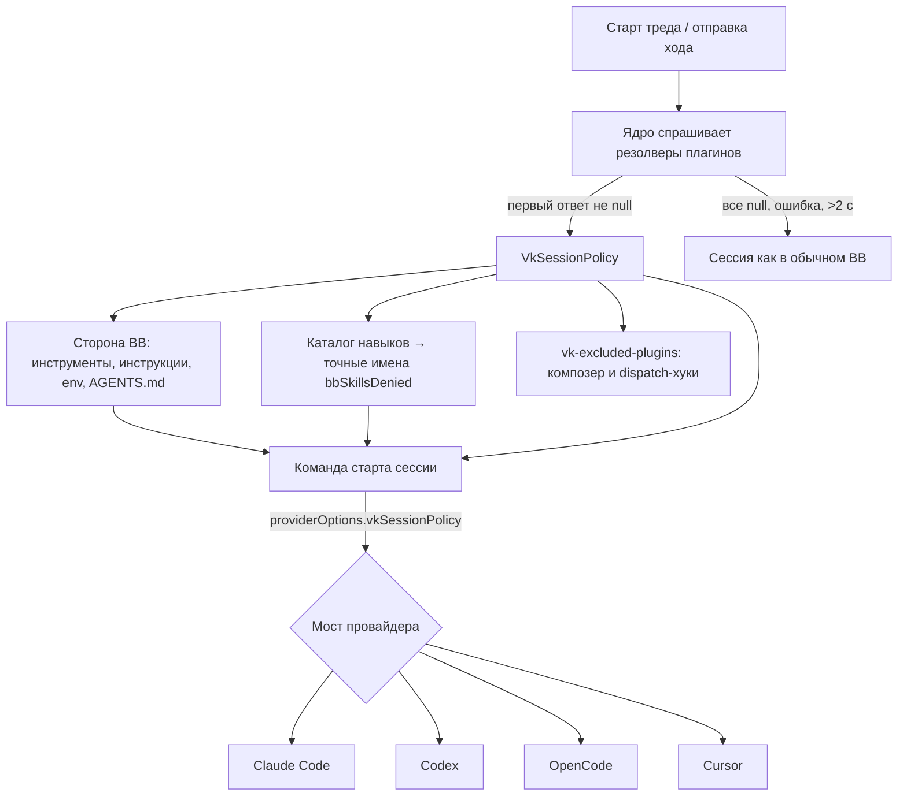

# Экспериментальные функции ядра BB (VK)

> [!NOTE]
> Этих функций нет в обычном BB. Они есть только в сборке из форка [VKirill/bb](https://github.com/VKirill/bb), ветка `vk/experimental`. Эта сборка сейчас работает на хабе. В коде все места помечены `VK EXPERIMENTAL`, у имён префикс `vk`. Список точек, где форк правит файлы upstream, лежит в [VK_PATCHES.md](VK_PATCHES.md).

Функции позволяют плагину решать, что загружается в конкретную сессию агента: плагины BB, навыки, MCP-серверы, плагины самих CLI и инструкции. Идея как у Multica: в BB может быть 100 навыков, а агенту конкретной роли достаются только его три.

Эталонный потребитель — плагин [project-folders](https://github.com/VKirill/bb-plugin-project-folders), вкладка «Контекст сессии». В нём правила задаются для всего BB, для проекта и для раздела и наследуются вниз по дереву.

## Состав

| # | Функция | Где | Для чего |
| --- | --- | --- | --- |
| 1 | `bb.agents.experimental_vkSessionPolicy(resolver)` | API плагина (сервер) | Плагин отвечает на вопрос «что грузить в эту сессию» |
| 2 | `VkSessionPolicy` | `@bb/domain/vk-session-policy` | Формат правил |
| 3 | `bb.agents.experimental_vkContextContributions()` | API плагина (сервер) | Что каждый плагин добавляет в сессии |
| 4 | Применение правил в ядре | `thread-runtime-config.ts`, `thread-commands.ts` | Отсекает инструменты, инструкции, env и навыки BB |
| 5 | `vkSessionPolicy` в опциях провайдера | мосты Claude Code, Codex, OpenCode, Cursor | Отсекает родные навыки, MCP и плагины CLI |
| 6 | Полное исключение плагина из места | `GET /api/v1/plugins/vk-excluded-plugins`, композер, dispatch-хуки | Исключённый плагин исчезает и из интерфейса, и из хуков |
| 7 | `vkPlace` у композера | `plugin-composer-host.tsx`, `NewThreadComposer.tsx` | Композер знает место нового треда до его создания |
| 8 | `useComposer().experimental_vkSetDispatchData` | API плагина (композер) | Скрытые данные на обычный Send без тега в черновике |
| 9 | Избранные модели | `ModelReasoningPicker` | Звезда в пикере; список в `localStorage`, без API плагина |
| 10 | `vkInstallCursorBridgeMcp` | мост ACP Cursor | Native tools плагинов BB в Cursor Grok через `bb-bridge` в `mcp.json` |
| 12 | `experimental_vkLifecycle` с действиями `reload` и `shutdown`, `bb.vk.startReason`, `bb.vk.afterDrain` | экспорт плагина, `vk.lifecycle.drain` в package.json | Плагин успевает остановить приём работы и сохранить состояние до перезагрузки и остановки сервера |
| 11 | `bb.background.experimental_vkSchedule(name, cron, fn, options)` и `vk.schedules` в package.json | API плагина (сервер), манифест | Изолированные расписания: долгий запуск не держит остальные |
| 11 | `bb.sdk.threads.experimental_vkSpawnKeyed`, `experimental_vkFindByKey`, `experimental_vkFindByPluginMetadata` | API плагина (SDK) | Идемпотентный spawn по ключу и поиск своих тредов по метаданным без перебора списка |


```mermaid
flowchart TD
  A[Старт треда / отправка хода] --> B[Ядро спрашивает резолверы плагинов]
  B -->|первый ответ не null| C[VkSessionPolicy]
  B -->|все null, ошибка, >2 с| Z[Сессия как в обычном BB]
  C --> D[Сторона BB: инструменты, инструкции, env, AGENTS.md]
  C --> E[Каталог навыков → точные имена bbSkillsDenied]
  D --> F[Команда старта сессии]
  E --> F
  C --> F
  F -->|providerOptions.vkSessionPolicy| G{Мост провайдера}
  G --> G1[Claude Code]
  G --> G2[Codex]
  G --> G3[OpenCode]
  G --> G4[Cursor]
  C --> H[vk-excluded-plugins: композер и dispatch-хуки]
```

---

## 1. `bb.agents.experimental_vkSessionPolicy(resolver)`

Регистрирует резолвер: функцию, которая для конкретного треда возвращает правила или `null`.

```ts
experimental_vkSessionPolicy?(
  resolver: (
    context: PluginAgentConfigurationContext,
  ) => VkSessionPolicy | null | Promise<VkSessionPolicy | null>,
): void;
```

**Когда вызывается.** В тех же точках и с тем же контекстом, что `bb.agents.configure`: при старте треда (`thread.start`) и при отправке хода (`turn.submit`).

**Контекст (`PluginAgentConfigurationContext`)** — стандартный, как у `configure`:

| Поле | Что внутри |
| --- | --- |
| `thread` | `id`, `title`, `parentThreadId`, `sourceThreadId` |
| `project` | `id`, `kind`, `name`, `gitRemoteUrl` |
| `environment` | `id`, `name`, `path` (папка сессии), `branchName` |
| `host` | `id`, `name` |
| `provider` | `id` (`claude-code`, `codex`, `opencode`, `cursor`…), `model`, `capabilities` |
| `origin` | `kind`, `pluginId` — для тредов, созданных плагином через `bb.sdk.threads.spawn`, здесь его id |
| `pluginMetadata` | метаданные треда под id вашего плагина, как в `configure` (недоверенные данные) |

**Правила работы:**

- Возвращайте `null`, если плагину нечего сказать про этот тред. Тогда сессия собирается как в обычном BB.
- Если резолверы есть у нескольких плагинов, побеждает **первый ответ не `null`** в порядке id плагинов. Правила **не объединяются** (подробнее в разделе про Агентство).
- Исключение, ответ неверной формы или ответ дольше 2 секунд попадают в лог и считаются `null`: сессия открывается без ограничений (fail open).
- Один резолвер на один запуск фабрики плагина.
- Плагин, чей ответ победил, никогда не исключается сам, даже если его id не попал в `bbPlugins`. Иначе правила могли бы отключить сами себя.

**Проверка наличия.** В обычном BB метода нет, поэтому сначала проверяйте его наличие. Типов в опубликованном `@get-bb/plugin-sdk` тоже нет, поэтому объявите их локально, как в project-folders:

```ts
type VkFilter = { mode: "allow" | "deny"; names: string[] };
type VkSessionPolicy = {
  bbPlugins?: VkFilter;
  skills?: VkFilter;
  mcpServers?: VkFilter;
  nativePlugins?: VkFilter;
  userInstructions?: boolean;
  projectInstructions?: boolean;
  claudeAiSync?: boolean;
};
type VkAgents = {
  experimental_vkSessionPolicy?: (
    resolver: (ctx: any) => VkSessionPolicy | null | Promise<VkSessionPolicy | null>,
  ) => void;
  experimental_vkContextContributions?: () => Array<{
    pluginId: string;
    instructions: boolean;
    configure: boolean;
    tools: string[];
    skills: string[];
  }>;
};

const agents = bb.agents as unknown as VkAgents;
export const vkAvailable = typeof agents.experimental_vkSessionPolicy === "function";

if (vkAvailable) {
  agents.experimental_vkSessionPolicy!((ctx) => {
    if (ctx.origin.pluginId !== "agency") return null; // not our thread
    const role = ctx.pluginMetadata.role; // written by Agency at spawn
    return policyForRole(role);
  });
}
```

Интерфейс настройки показывайте только при `vkAvailable === true`. Так сделано в project-folders: на обычном BB вкладки «Контекст сессии» просто нет.

---

## 2. Формат правил `VkSessionPolicy`

Все поля необязательные. Отсутствующее поле значит «грузить как обычно», поэтому пустой объект `{}` ничего не меняет.

| Поле | Тип | Что ограничивает | Какие имена |
| --- | --- | --- | --- |
| `bbPlugins` | фильтр | Плагины BB: их инструкции, инструменты агента, навыки, env, а также UI и хуки в этом месте | id плагина: `agency`, `env-catalog`, `lane-pilot` |
| `skills` | фильтр | Навыки по имени: и из BB, и родные навыки CLI | как их вызывает агент: `ru-text`, `lane-stack:ru-text` |
| `mcpServers` | фильтр | Родные MCP-серверы CLI | имя сервера из `~/.claude.json`, `.mcp.json`, `~/.codex/config.toml` и т. п.; для MCP плагинов Claude — `plugin:<plugin>:<server>` или короткое имя |
| `nativePlugins` | фильтр | Плагины самих CLI | Claude: `name@marketplace`; Codex: id плагина |
| `userInstructions` | `boolean` | Общие инструкции BB `<dataDir>/AGENTS.md` | `false` — не грузить |
| `projectInstructions` | `boolean` | `.bb/AGENTS.md` раздела и `CLAUDE.md` / `AGENTS.md`, которые CLI находит в папке и её родителях | `false` — не грузить |
| `claudeAiSync` | `boolean` | Синхронизацию навыков и плагинов из claude.ai в Claude Code | `false` — выключить |

**Фильтр** — `{ mode: "allow" | "deny", names: string[] }`:

- `allow` — оставить только перечисленное, всё прочее убрать;
- `deny` — убрать перечисленное, остальное оставить;
- имена сравниваются точно, `*` в конце означает префикс: `lane-stack:*`;
- у одного предмета может быть несколько написаний (`ru-text` и `lane-stack:ru-text`). `allow` пропускает его, если указано любое из них, `deny` убирает, если указано любое;
- лимиты: до 500 имён в списке, имя до 200 символов.

Пример — «агент-копирайтер»: из плагинов BB только env-catalog, два навыка, без MCP, без инструкций проекта:

```json
{
  "bbPlugins": { "mode": "allow", "names": ["env-catalog"] },
  "skills": { "mode": "allow", "names": ["ru-text", "lane-stack:copy-*"] },
  "mcpServers": { "mode": "allow", "names": [] },
  "projectInstructions": false
}
```

> [!IMPORTANT]
> Некоторые элементы ядро не даёт исключить никаким правилам:
> - плагин `environment-project-checkout`, если он установлен (`VK_REQUIRED_PLUGIN_IDS`): без него BB не запускает и не показывает треды. Он остаётся в сессии, в композере и в хуках, даже если указан в `deny` или не указан в `allow`;
> - `bb-bridge`, служебный MCP самого BB, через который идут инструменты плагинов. Ядро убирает его из `deny` и добавляет в `allow`, прежде чем правила попадут в мост.
>
> В `experimental_vkContextContributions()` у таких плагинов `required: true`: редактору стоит показывать их заблокированными.

---

## 3. `bb.agents.experimental_vkContextContributions()`

Возвращает список всех запущенных плагинов с тем, что каждый добавляет в сессии агентов:

```ts
interface VkContextContribution {
  pluginId: string;
  required: boolean;     // no policy can leave it out
  instructions: boolean; // adds instructions (contributeInstructions / dynamic)
  configure: boolean;    // chooses its tools and skills per thread via configure
  tools: string[];       // agent tool names
  skills: string[];      // skill names
}
```

Для чего нужен: в редакторе правил можно подписать каждый плагин («добавляет инструкции, 5 инструментов, 3 навыка») и отличить плагины, которые меняют контекст, от плагинов, которые дают только интерфейс. В project-folders из этого сделаны подписи у переключателей.

---

## 4. Что ядро делает само (сторона BB)

Когда правила получены, ядро до старта сессии:

1. **Убирает инструменты агента** плагинов, которые не прошли `bbPlugins`. Встроенные инструменты ядра (например, `update_environment_directory`) остаются.
2. **Убирает инструкции** этих плагинов: и статические, и динамические, и инструкции к их инструментам.
3. **Убирает переменные окружения** этих плагинов (`contributeProviderEnv`). Проверено на cli-agents: исключённый плагин не может навязать агента через env.
4. При `userInstructions: false` убирает `<dataDir>/AGENTS.md`, при `projectInstructions: false` — `.bb/AGENTS.md` рабочей папки.
5. **Навыки BB** (из плагинов, `<dataDir>/skills`, `.bb/skills` проекта) проверяет по каталогу и превращает в точный список запрещённых имён `bbSkillsDenied`. Навык отсекается, если не прошёл его плагин или его имя не прошло `skills`.

Общий каталог навыков окружения не меняется. Каждый мост собирает для своей сессии отфильтрованную копию из симлинков (`vkFilterSkillRoot`). Поэтому два треда с разными правилами в одном окружении не мешают друг другу.

---

## 5. Правила в мостах провайдеров

Остальное ядро передаёт мосту в опции провайдера `vkSessionPolicy`. Её формат — `VkRuntimeSessionPolicy`: `bbSkillsDenied`, `skills`, `mcpServers`, `nativePlugins` и флаги `projectInstructions: false`, `claudeAiSync: false`. Отдельный `HOME`, `CLAUDE_CONFIG_DIR` или `CODEX_HOME` не создаётся, поэтому вход в аккаунт и возобновление сессий работают как раньше.

| Провайдер | Навыки BB | Родные навыки | MCP-серверы | Плагины CLI | Инструкции проекта |
| --- | --- | --- | --- | --- | --- |
| **Claude Code** | отфильтрованная папка плагина навыков | SDK `skills` (allow), `skillOverrides` + `disallowedTools: Skill(...)` | `strictMcpConfig` + конфиги из `~/.claude.json`, `.mcp.json` и `.mcp.json` включённых плагинов; `deniedMcpServers` | `enabledPlugins: false` | `claudeMdExcludes` (папка, родители, подпапки; `~/.claude` пользователя остаётся) |
| **Codex** | отфильтрованные доп. корни | `-c skills.config=[{path\|name, enabled=false}]`, рекурсивно, имя из frontmatter | `-c mcp_servers.<n>.enabled=false` (только серверы из `config.toml`) | `-c plugins.<id>.enabled=false` | `-c project_doc_max_bytes=0` |
| **OpenCode** | фильтр списка навыков в инструкциях | `OPENCODE_CONFIG_CONTENT` → `permission.skill` | `OPENCODE_CONFIG_CONTENT` → `mcp.<n>.enabled=false` | — | `OPENCODE_DISABLE_PROJECT_CONFIG=1` |
| **Cursor (Grok)** | фильтр списка навыков в инструкциях | — | отдельный `CURSOR_DATA_DIR` на набор правил (`~/.cursor/bb-vk-overlays/<hash>`) со своим `mcp-disabled.json`; настоящая папка проекта подключена ссылкой | — | — |

`claudeAiSync: false` ставит в Claude Code `syncClaudeAiSkills` и `syncClaudeAiPlugins` в `false`.

---

## 6. Полное исключение плагина из места

Если правила места убирают плагин (`bbPlugins`), BB ведёт себя там так, будто плагина нет:

- **Сессия:** нет инструментов, инструкций, навыков и env (раздел 4).
- **Композер:** не рисуются кнопки, баннеры, чипы и прочие вставки плагина в поле ввода. Фильтр стоит в `useResolvedComposerSlot`.
- **Отправка сообщения:** `message.dispatch` пропускает хуки плагина и отбрасывает его данные из композера.

Список исключённых для места отдаёт маршрут:

```http
GET /api/v1/plugins/vk-excluded-plugins?threadId=thr_…
GET /api/v1/plugins/vk-excluded-plugins?projectId=…&hostId=…&environmentId=…&path=…
→ { "pluginIds": ["agency"] }
```

Для существующего треда достаточно `threadId`. Для нового треда, которого ещё нет, композер передаёт проект, машину, окружение и папку раздела. В обычном BB маршрута нет; клиент тогда считает, что ничего не исключено. На клиенте ответ кешируется на 15 секунд.

> [!TIP]
> Для Агентства это значит: если в разделе Агентство выключено, его переключатель «Сам сделает / Агентство / По запросу» в этом разделе не появится, а его dispatch-хук не сработает. Отдельно в Агентстве это делать не нужно.

---

## 7. `vkPlace` у композера

Необязательное поле `vkPlace` у хоста композера (`plugin-composer-host.tsx`) — место, для которого композер спрашивает список исключённых плагинов. В новом треде его заполняет `NewThreadComposer`. Папку раздела он берёт из `environmentSeed.providerInputs`, потому что поле отправки её теряет. Плагину здесь ничего делать не нужно: это внутренняя часть функции 6.

---

## 8. Обязательные правила и собранный профиль при создании треда

`bb.agents.experimental_vkRequiredSessionPolicy()` возвращает, что ядро умеет: группы правил для каждого провайдера, переключатели инструкций и обязательные ресурсы (`bb-bridge`, папка проекта). Плагин передаёт снимок правил при создании треда: `threads.spawn({ experimental_vkRequiredSessionPolicy: { version: 1, policy } })`. В отличие от `experimental_vkSessionPolicy`, этот снимок записывается вместе с тредом и действует на каждый ход. Расширить его нельзя. Дочерний тред, форк и тред-владелец наследуют его как потолок.

`bb.agents.experimental_vkCompiledMainAgent()` и `threads.spawn({ experimental_vkCompiledMainAgent: profile })` задают тред Claude Code собранный профиль главного агента (`id`, `prompt`, `sourceHash`).

## 10. Drain при reload и shutdown: `experimental_vkLifecycle` с `reload` и `shutdown`

Зачем. Стоковый reload сразу отключает старый экземпляр плагина: обрываются вызовы инструментов, сервисы и host-воркер, ретраи теряются, стадии расходятся. Если плагин объявил drain, ядро сначала даёт старому экземпляру время остановить приём новой работы и сохранить состояние.

Включение. Только явное, полем package.json верхнего уровня (рядом с `bb`, не внутри него):

```json
{ "vk": { "lifecycle": { "drain": { "timeoutMs": 120000 } } } }
```

`timeoutMs` от 1000 до 600000, без значения 30000. Значения вне диапазона урезаются с записью в лог плагина, ошибка в поле не мешает загрузке плагина. Без поля reload и остановка сервера идут как в стоковом BB.

Что происходит при reload плагина с drain.

1. Новый экземпляр загружен (фабрика отработала), но ещё не активирован.
2. Плагин переходит в состояние draining: новые `message.dispatch`, `contributeEnv`, разбор упоминаний и вызовы инструментов этого плагина ждут нового экземпляра (не дольше собственного таймаута хука) и исполняются уже в нём. Расписания, которые наступили за это время, не запускаются сейчас и остаются просроченными для нового экземпляра.
3. Ядро вызывает `experimental_vkLifecycle({ action: "reload", deadline, signal, kv, callHost })` у старого экземпляра (в том модуле, что его породил). По дедлайну `signal` срабатывает, в лог идёт запись, reload продолжается. Исключение из обработчика тоже только логируется.
4. Старый экземпляр освобождается, новый активируется, очередь ожидающих работы отпускается.

При остановке сервера то же самое с `action: "shutdown"`, но нового экземпляра нет: ожидающая работа упирается в собственные таймауты.

```ts
export async function experimental_vkLifecycle(ctx) {
  if (ctx.action === "reload" || ctx.action === "shutdown") {
    stopAcceptingNewStages();
    await waitForAcceptanceAndLocks({ signal: ctx.signal }); // до ctx.deadline
    await ctx.kv.set("drain.snapshot", snapshot());
    return;
  }
  // enable / disable / remove: как раньше
}
export default function plugin(bb) {
  // бывает undefined на стоковом BB
  const reason = bb.vk?.startReason; // "boot" | "enable" | "reload"
  bb.background.service("recovery", {
    async start(signal) {
      // afterDrain читать здесь, не в фабрике: в фабрике он ещё false
      if (bb.vk?.afterDrain) await resumeFromSnapshot();
      else await fullRecovery();
      await waitForAbort(signal);
    },
  });
}
```

Новому экземпляру. `bb.vk.startReason`: `boot` (старт сервера или первая загрузка), `enable` (пользователь включил плагин) или `reload` (заменил работающий). `bb.vk.afterDrain`: предыдущий экземпляр успел завершить drain до дедлайна. Фабрика плагина, объявившего drain, получает понятную ошибку, если зовёт host: «call the host from a background service (bb.background.service) or a handler». Вызывать host надо из сервиса или обработчика, они стартуют после того, как предыдущий экземпляр остановлен.

Чего нет. Состояние drain хранится только в памяти сервера. Обычные enable, disable и remove работают как раньше. Дев-перезагрузка встроенных плагинов (`reloadPlugin`), отключение и приостановка при переезде сервера drain не запускают. Миграций и изменений протокола машин нет.

---

Снимки и отметки с их отпечатком лежат в зарезервированных строках метаданных треда с id, начинающимся на `__vk.`. Плагины эти строки не видят и записать в них не могут. Если отметка или снимок пропали или повреждены, тред не запускается. Миграций и изменений протокола машин нет.

## 9. Изолированные расписания: `bb.background.experimental_vkSchedule`

В обычном BB `sweepDueSchedules` запускает просроченные расписания всех плагинов по очереди и ждёт каждое. Одно долгое расписание держит все остальные: 03.10 запуск Lane Pilot стоял 50 минут и заблокировал и самовосстановление, и расписания других плагинов. Изолированное расписание запускается без ожидания.

```ts
experimental_vkSchedule?(
  name: string,
  cron: string,
  fn: (context: { signal: AbortSignal }) => void | Promise<void>,
  options?: { isolated?: boolean; timeoutMs?: number; overlap?: "skip" },
): void;
```

Без кода, в `package.json` плагина, на верхнем уровне (рядом с `bb`, не внутри него):

```json
{ "bb": { "...": "..." }, "vk": { "schedules": { "sweep": { "isolated": true, "timeoutMs": 1800000 } } } }
```

Запись `vk.schedules.<имя>` действует на расписание, зарегистрированное обычным `bb.background.schedule(имя, ...)`. Такая функция тоже получает `{ signal }` первым аргументом (старая запись `() => ...` работает как есть). Параметры вызова API сильнее манифеста, поле за полем. Манифест читается мягко: неверное или неизвестное значение игнорируется с предупреждением в логе при загрузке, плагин всё равно загружается. Из ключа `vk` читается только `schedules`.

**Что делает ядро:**

| Правило | Как |
| --- | --- |
| Без ожидания | расписание стартует и сразу отпускает проход, остальные идут как обычно |
| Один запуск на (плагин, имя) | пока предыдущий идёт, просроченный тик пропускается: `next_run_at` сдвигается по cron, `last_run_at` и `last_status` остаются от идущего запуска |
| Потолок 8 | одновременно не больше 8 изолированных запусков; сверх этого тик пропускается так же и пишется в лог, очереди нет |
| Таймаут | по умолчанию 15 минут, максимум 6 часов (больше обрезается с предупреждением). По истечении сигнал `signal` срабатывает, результат записывается как `last_status = error`, `last_error = "timeout after <N>ms"` |
| Слот до конца функции | после таймаута слот занят, пока функция не завершится: функция, не слушающая `signal`, не получит второй запуск поверх себя |
| Выгрузка плагина | отключение, перезагрузка и удаление плагина срабатывают `signal` и освобождают слоты (`last_error = "aborted: plugin stopped or reloaded"`) |

Значение `timeout` в колонке статуса не вводится: перечень `running | ok | error` в API и интерфейсе остаётся прежним, поэтому `bb plugin list` и вкладка плагина показывают таймаут как ошибку с понятным текстом.

**Без функции.** В обычном BB метода нет, ключ `vk` в `package.json` игнорируется (схема внешнего `package.json` пропускает неизвестные поля). Плагин проверяет `typeof bb.background.experimental_vkSchedule === "function"` и иначе вызывает `bb.background.schedule(...)`: расписание работает, но по очереди. Плагин без опций ведёт себя байт в байт как раньше.

**Пример (Lane Pilot).**

```ts
const fn = async ({ signal }: { signal?: AbortSignal } = {}) => { await runSweep(signal); };
if (typeof bb.background.experimental_vkSchedule === "function") {
  bb.background.experimental_vkSchedule("stage-sweep", "*/5 * * * *", fn, {
    isolated: true,
    timeoutMs: 45 * 60_000,
  });
} else {
  bb.background.schedule("stage-sweep", "*/5 * * * *", () => fn());
}
```

**Проверка наличия:** `typeof bb.background.experimental_vkSchedule === "function"`.

**Тест:** `apps/server/test/services/plugins/plugin-vk-schedule-options.test.ts`. Код: `apps/server/src/services/plugins/vk-schedule-options.ts`.

---

## 9. Ключи тредов: `experimental_vkSpawnKeyed`, `experimental_vkFindByKey`, `experimental_vkFindByPluginMetadata`

Зачем. Если ответ на `threads.spawn` потерялся (reload, обрыв), плагин не знает id своего треда и ищет его перебором `threads.list`. В проекте с тысячами тредов перебор упирается в лимит страниц, и задача зависает. Ключ делает spawn повторяемым, а поиск по метаданным не требует перебора.

```ts
// на обычном BB этих методов нет
if (typeof bb.sdk.threads.experimental_vkSpawnKeyed === "function") {
  const { thread, reused } = await bb.sdk.threads.experimental_vkSpawnKeyed({
    ...обычные поля spawn, // projectId, prompt, environment, pluginMetadata ...
    key: `lp:${attemptId}:writer:1`, // 1..200 символов, уникален в пределах плагина
  });
  // reused === true: живой тред с этим ключом уже был, второй не создан
}
const found = await bb.sdk.threads.experimental_vkFindByKey(key); // тред или null
const list = await bb.sdk.threads.experimental_vkFindByPluginMetadata({
  match: { attemptId: "att1", role: "writer" }, // строки, числа, булевы; не пусто
  projectId, includeArchived: false, limit: 100, // projectId и includeArchived необязательны, limit 1..100
}); // новые первыми
```

Поведение.

| Случай | Результат |
| --- | --- |
| Два параллельных `vkSpawnKeyed` с одним ключом | один тред; у второго `reused: true` |
| Ключ у плагина A, тот же ключ у плагина B | независимы: ключ действует только в пределах плагина |
| Тред с ключом удалён | `vkFindByKey` его не возвращает, ключ можно использовать заново |
| Тред с ключом в архиве | ключ за ним сохраняется, `vkSpawnKeyed` вернёт его с `reused: true` |
| `vkFindByPluginMetadata` | видит только строки метаданных вызывающего плагина; удалённые треды не попадают, архивные только с `includeArchived: true` |
| Обычные `threads.spawn`, `threads.list` | не изменены |

Хранение. Ключ лежит в зарезервированном поле `__vk.key` строки `thread_plugin_metadata` самого плагина, рядом с его обычными метаданными. Проверка «ключ занят» и вставка идут в одной транзакции создания треда. `updatePluginMetadata` может повторно отправить ключ без изменений, но изменить или удалить его не может (`reserved_key`). Миграций, новых таблиц и изменений протокола машин нет.

Скорость. Индекса по полю нет, запрос читает строки метаданных одного плагина. Замер на выгрузке хаба 2026-10-07 (5963 строки метаданных, из них 2414 у lane-pilot, у всех поставлен ключ; 4104 треда): промах 1,7 мс, попадание 0,1 мс, `vkFindByPluginMetadata` по роли 1,7 мс на запрос. Время растёт линейно с числом строк плагина; порог 50 мс будет достигнут примерно на 70 000 строках. Если дойдёт, делать `projectId` обязательным.

Без функции. Метода нет, `typeof` даёт `"undefined"`: плагин остаётся на `threads.spawn` и переборе списка.

---

## Как внедрить в Агентство

> [!WARNING]
> **Главное ограничение: правила не объединяются.** Побеждает первый ответ не `null` по алфавиту id плагинов. `agency` идёт раньше `project-folders`. Если Агентство вернёт правила для треда, правила раздела из project-folders для этого треда **полностью перестанут действовать**.

Рекомендуемая схема — как у Multica: правила по роли агента.

1. **Отвечать только за свои треды.** Для остальных возвращать `null`. Треды, созданные через `bb.sdk.threads.spawn`, ядро помечает id плагина: `ctx.origin.pluginId === "agency"`. Роль сотрудника удобно записать в метаданные треда при создании (`pluginMetadata`) и прочитать в резолвере из `ctx.pluginMetadata`. Обычные треды пользователя пусть остаются за project-folders.
2. **Хранить правила у роли:** какие навыки, MCP, плагины CLI и BB нужны копирайтеру, ревьюеру и т. д. Резолвер собирает из них `VkSessionPolicy`.
3. **Держать себя в `bbPlugins`, если нужны свои инструменты.** Технически владелец правил и так не исключается, но явное указание понятнее.
4. **Показывать настройку только при `vkAvailable`.** На обычном BB Агентство должно работать как сейчас.
5. **Если правилам раздела всё же нужно действовать и в тредах Агентства:** сейчас это возможно, только если Агентство само строит пересечение с правилами раздела. Удобнее доработать ядро, чтобы оно объединяло ответы нескольких плагинов (пересечение allow, объединение deny). Это следующий шаг в форке, если понадобится.
6. **Проверять вживую**, а не только тестами. Запустить тред роли и спросить агента, какие у него навыки, MCP-серверы и инструменты. Или посмотреть аргументы процесса CLI.

---

## Ограничения

| Что | Статус |
| --- | --- |
| Cursor | родные навыки и инструкции проекта | не ограничиваются: у Cursor нет таких настроек |
| Cursor Grok | tools плагинов BB | `vkInstallCursorBridgeMcp`: `bb-bridge` в `mcp.json` до запуска `cursor-agent` |
| `bb-bridge` | всегда подключён, это служебный канал BB |
| Смена правил посреди сессии | надёжно применяется при старте сессии провайдера. После изменения правил откройте новый тред |
| Объединение правил нескольких плагинов | нет, побеждает первый ответ не `null` |
| Codex MCP | отключаются только серверы, описанные в `config.toml`; иначе Codex падает с `Error: bootstrap` |
| Версия пакета | собрано как 0.43.3: host-daemon проверяет совпадение версии |

## Проверки

- **Юнит-тесты в форке:**
  - `packages/domain/test/vk-session-policy.test.ts`;
  - `apps/server/test/threads/vk-session-policy.test.ts`;
  - `apps/server/test/services/plugins/plugin-vk-session-policy.test.ts`;
  - `packages/provider-bridge-acp/src/vk-cursor-bridge-mcp.test.ts`;
  - `apps/app/src/components/plugin/vk-composer-exclusion.test.tsx`;
  - `apps/app/src/components/plugin/vk-composer-dispatch.test.ts`.
- **Живые проверки на хабе** (runtime `0.43.3-vk.9`) через настоящие треды:
  - навыки, MCP и плагины CLI в Claude Code, Codex и OpenCode;
  - сторона BB и MCP в Cursor;
  - режим allow для плагинов BB;
  - MCP плагинов Claude;
  - env от cli-agents;
  - инструкции проекта и синхронизация с claude.ai;
  - исключение Agency из композера нового треда в разделе.

## Ссылки

- Форк ядра: <https://github.com/VKirill/bb>, ветка `vk/experimental`; список правок upstream-файлов — [VK_PATCHES.md](VK_PATCHES.md).
- Формат правил: [packages/domain/src/vk-session-policy.ts](packages/domain/src/vk-session-policy.ts).
- Контракт API плагина: [packages/plugin-sdk/src/backend-contract.ts](packages/plugin-sdk/src/backend-contract.ts) (`PluginAgents`).
- Эталонный потребитель: <https://github.com/VKirill/bb-plugin-project-folders>, файлы `session-policy-server.ts`, `session-policy.ts`, `session-policy-ui.tsx`.
